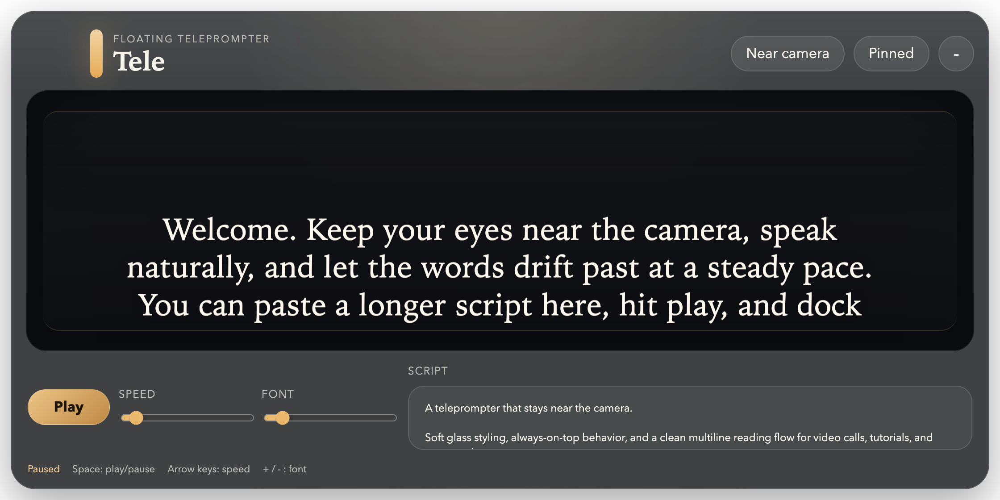
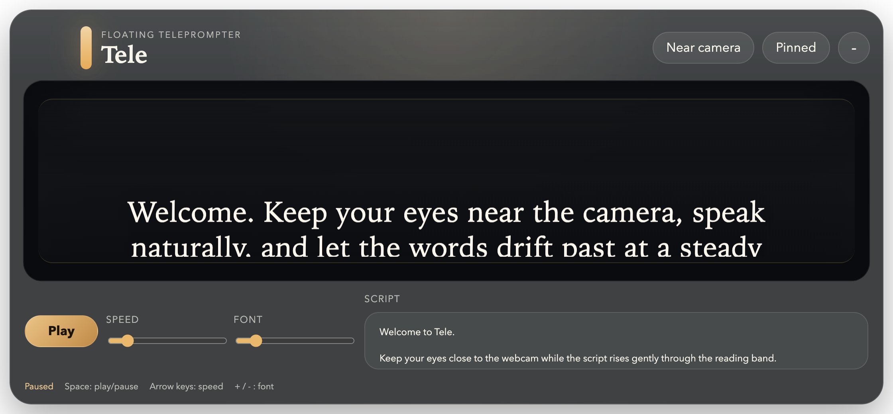

# Tele

<p align="center">
  A floating macOS teleprompter that sits near your webcam, scrolls upward like a real prompter, and helps you keep eye contact while you speak.
</p>

<p align="center">
  <strong>Electron</strong> · <strong>macOS-first</strong> · <strong>Always on top</strong> · <strong>Multiline scroll</strong>
</p>

<p align="center">
  
</p>

## What It Does

Tele is a compact desktop teleprompter for macOS with a clean multiline reading surface, a slow upward script flow, and a floating window that can be docked near the camera.

It is built for screen recordings, live presentations, tutorials, video calls, and any moment where you want your notes close to the lens instead of buried on a second monitor.

## Why It Feels Good

- The reading area is designed for actual speaking, not just dumping text on screen
- The window stays light and unobtrusive instead of becoming a full desktop app
- The scroll moves upward in a familiar teleprompter rhythm
- The `Near camera` action makes it easy to recover your preferred placement quickly

## Highlights

- Multiline upward scroll that feels like a real teleprompter instead of a ticker
- Transparent always-on-top window for a lightweight desktop presence
- `Near camera` action to snap the window back to the top-center reading position
- Adjustable font size and scroll speed
- Frameless glass UI with keyboard shortcuts for quick control while recording

## Gallery

The screenshots below are captured directly from the app UI.

<p align="center">
  
  
</p>

## Best For

- YouTube videos and course recording
- Live demos and keynote-style talks
- Video calls where your notes need to stay close to the lens
- Tutorial walkthroughs with a cleaner speaking flow
- Solo creators who want a minimal teleprompter without a heavy setup

## Quick Start

```bash
npm install
npm start
```

Open the app, paste your script, press `Play`, and dock it near the webcam.

## Controls

| Action | Shortcut |
| --- | --- |
| Play or pause | `Space` |
| Increase speed | `Arrow Up` or `Arrow Right` |
| Decrease speed | `Arrow Down` or `Arrow Left` |
| Increase font size | `+` |
| Decrease font size | `-` |

## How It Works

1. Paste your script into the editor.
2. Press `Play`.
3. Use `Near camera` to re-center the window under your webcam.
4. Adjust speed and font size until the reading pace feels natural.

## Project Layout

| File | Purpose |
| --- | --- |
| `main.js` | Creates the floating Electron window and handles window actions |
| `renderer.js` | Drives the teleprompter motion, controls, and shortcuts |
| `styles.css` | Defines the glass UI, reading surface, and layout |
| `assets/` | README screenshots |

## Notes

- The window opens near the top of the primary display by default.
- The app is designed to stay visible over other windows while you present.
- Screenshot assets in this README were generated directly from the app UI.

## Future Ideas

- Mirror mode for beam-splitter teleprompter rigs
- Saved scripts and recent sessions
- Opacity and reading-band controls
- Remote control from a phone or keyboard-only mode
